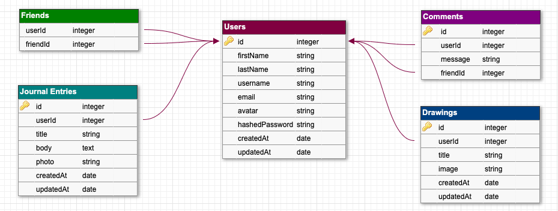
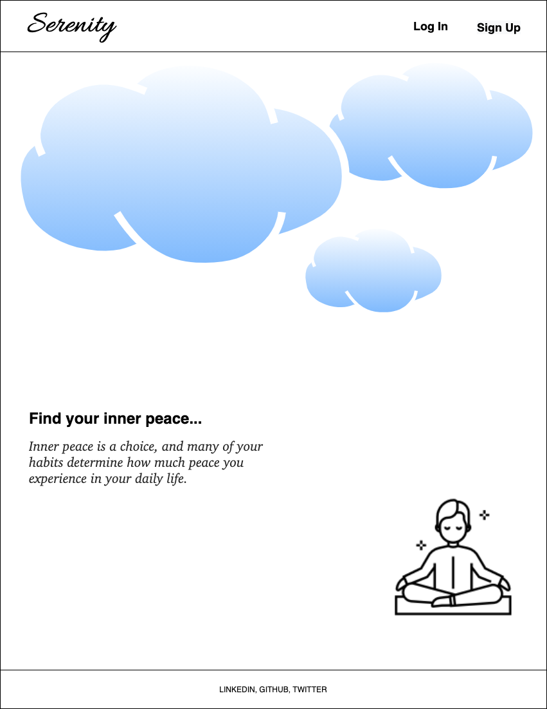
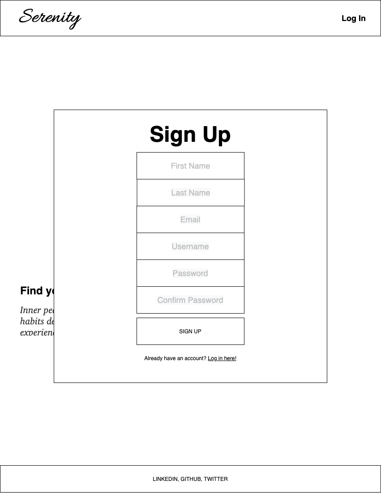
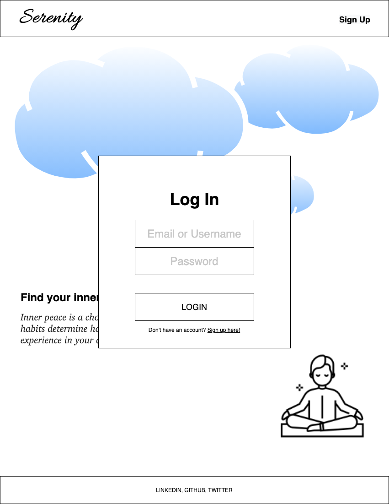
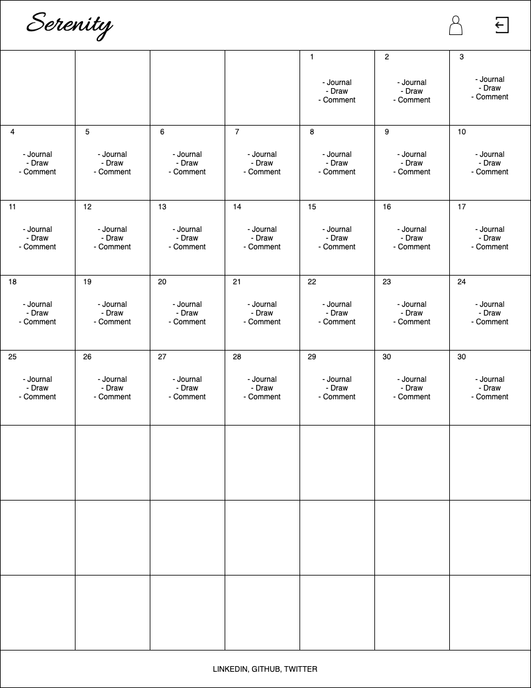
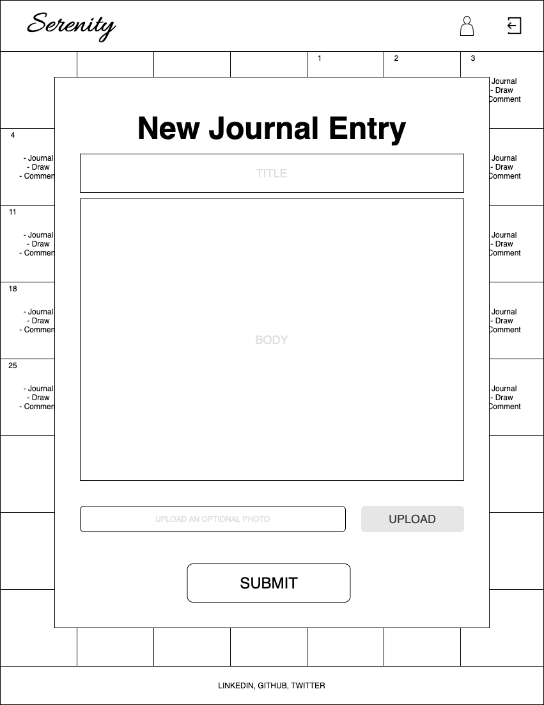
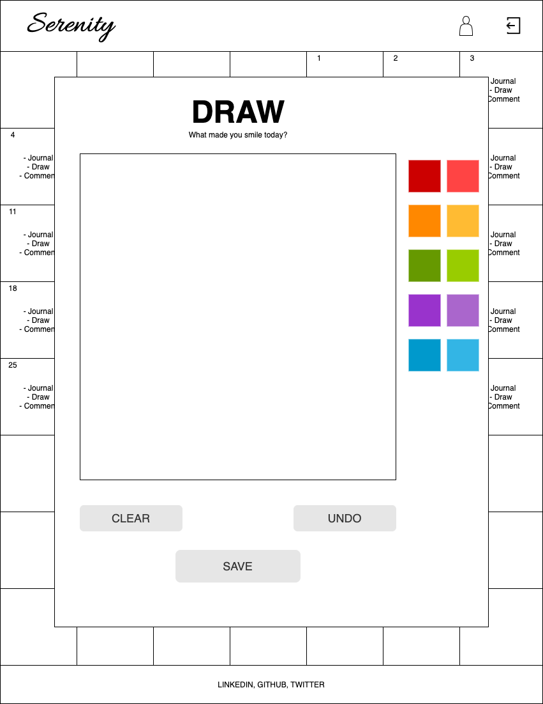
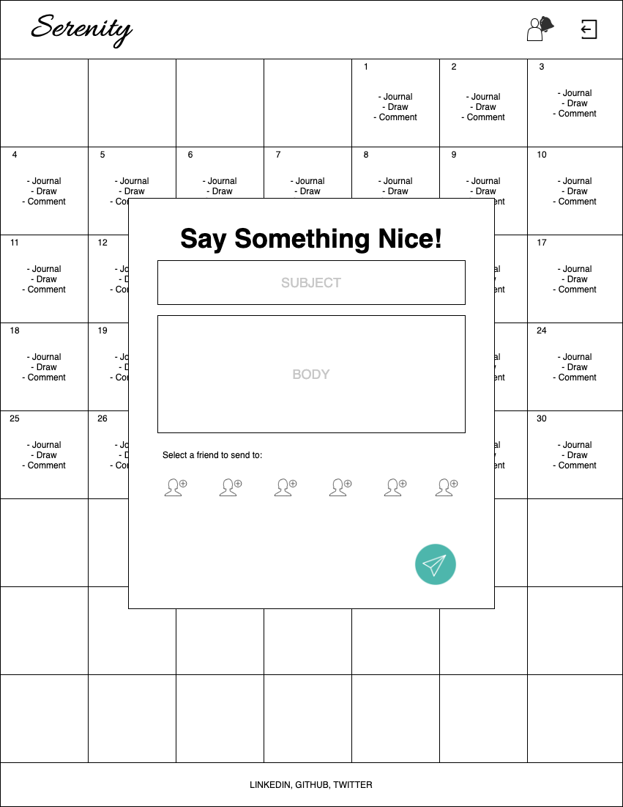
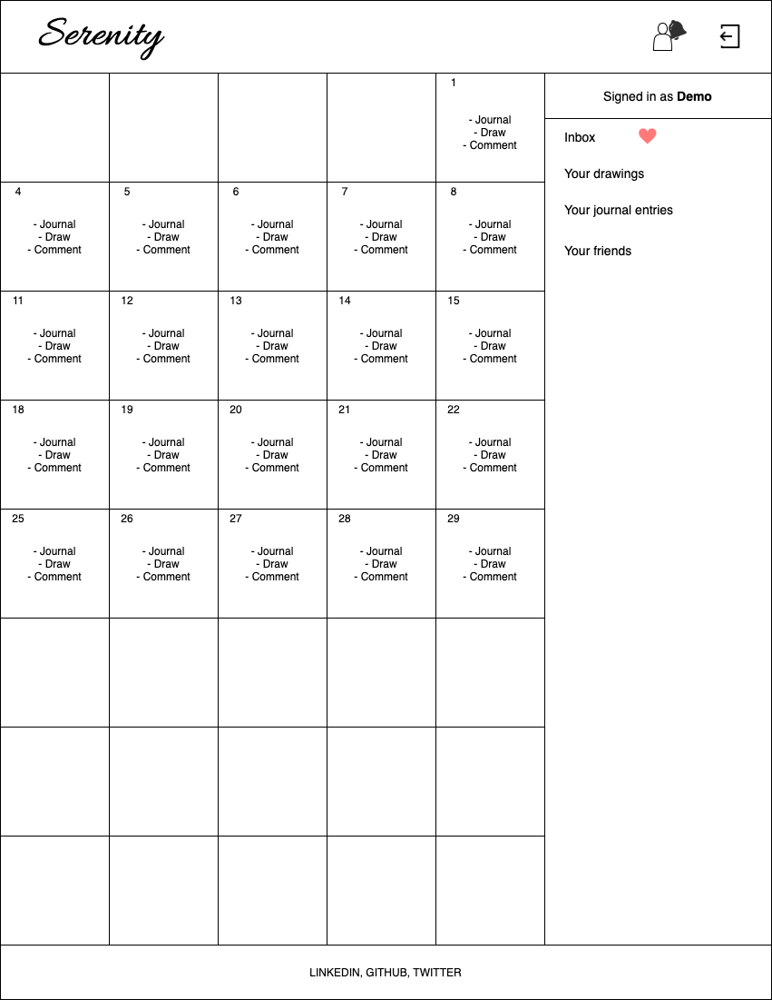
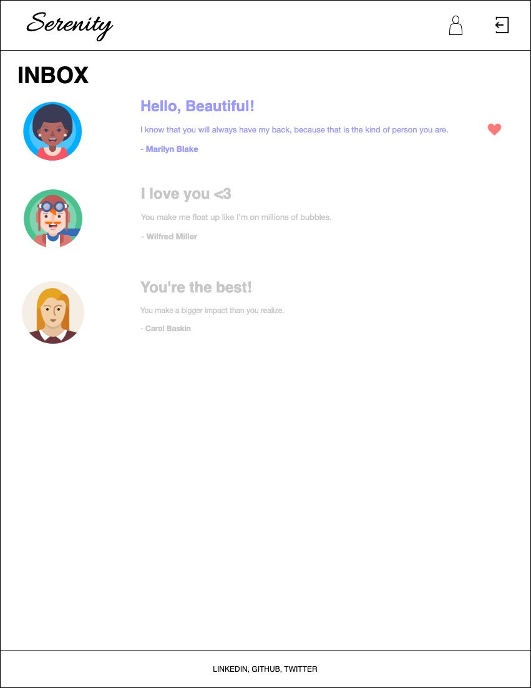

# Serenity App

   This app utilizes Flask SQLAlchemy for its backend and React.js/Redux.js for its frontend.
 
 

## Project Description

   * Serenity will be an app for users looking for some positivity in their lives! When a user accesses the home page, there’ll be tranquil music playing (ocean waves, LoFi music, classical music, etc.). When a user successfully signs up and logs in, they’ll be able to complete a list of tasks every day (journal, draw, and leave nice comments for other users). Nice comments will be displayed at the top of the page, where it'll be randomized in an array and a new one will appear for every render.
 
 

## MVP
   * Will be hosted on Heroku
   * Audio will be downloaded from a third party API, playing on a loop
   * User dashboards will be displayed as a calendar with a list of tasks to complete every day
   * Logged in users can write journals, draw images with a virtual canvas, and leave nice comments for other users
 
 

## Database Schema and Diagram:

### `Users`
| Column Name    | Data Type | Details                |
|----------------|:---------:|------------------------|
| id             | integer   | not null, primary key  |
| firstName      | string    | not null               |
| lastName       | string    | not null               |
| username       | string    | not null, indexed      |
| email          | string    | not null, indexed      |
| avatar         | string    | no constraints         |
| hashedPassword | string    | not null               |
| createdAt      | datetime  | not null               |
| updatedAt      | datetime  | not null               |

* unique index on `username`
* unique index on `email`
* `avatar` will be URL to picture using [AWS](https://aws.amazon.com/s3/)
* `Users` have many `journal entries` and `drawings`
 
 

### `Journal_Entries`
| Column Name | Data Type | Details                         |
|-------------|:---------:|---------------------------------|
| id          |  integer  | not null, primary key           |
| userId      |  integer  | not null, foreign key           |
| title       |   string  | no constraints                  |
| body        | text      | no constraints                  |   
| photo       | string    | no constraints                  |

* Unique index on `userId`
* `photo` will be URL to picture using [AWS](https://aws.amazon.com/s3/)
* A `journal entry` belongs to a `user`
 
 

### `Drawings`
| Column Name | Data Type | Details                         |
|-------------|:---------:|---------------------------------|
| id          |  integer  | not null, primary key           |
| userId      |  integer  | not null, foreign key           |
| title       |   string  | no constraints                  |   
| image       |   string  | not null                        |

* Unique index on `userId`
* `photo` will be URL to picture using [AWS](https://aws.amazon.com/s3/)
* A `drawing` belongs to a `user`
 
 

### `Comments`
| Column Name | Data Type | Details               |
|-------------|:---------:|-----------------------|
| id          |  integer  | not null, primary key |
| userId      |  integer  | not null, foreign key |
| message     |   text    | not null              |
| friendId    |  integer  | not null, foreign key |

* Unique index on `userId` and `friendId`
 
 

### `Friends` (Join Table)
| Column Name | Data Type | Details               |
|-------------|:---------:|-----------------------|
| userId      |  integer  | not null              |
| friendId    |  integer  | not null              |
 
 

 
 

## WIREFRAMES
**PATH**: `"/"`

 
 

**PATH**: `/signup`

 
 

**PATH**: `"/login"`

 
 

**PATH**: `"/dashboard"`

 
 

**PATH**: `"/new/journal"`

 
 

**PATH**: `"/new/canvas"`

 
 

**PATH**: `"/new/comment"`

 
 

**PATH**: `"/dashboard"`

 
 

**PATH**: `"/inbox"`

 
 

## Components List
  * Splash Page
  * Login Modal
  * Signup Modal
  * Calendar/Dashboard Page
  * Journal Modal
  * Canvas Modal
  * Comment Modal
  * Drawer Component
  * Inbox component

## Technologies
   * React
   * Flask
   * React-calendar npm
   * React-canvas-draw npm
   * Component library TBD
